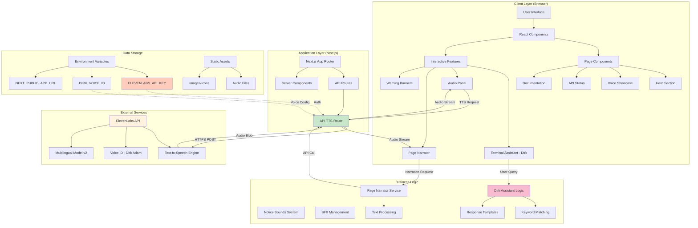
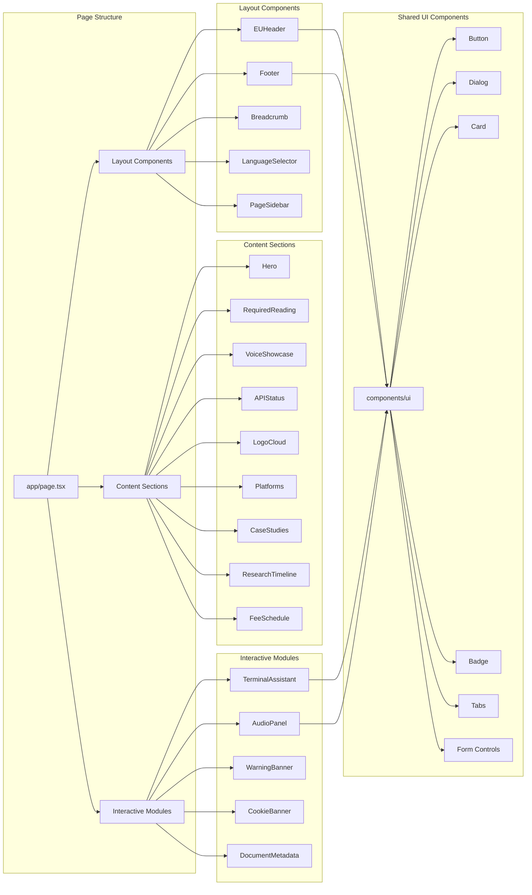
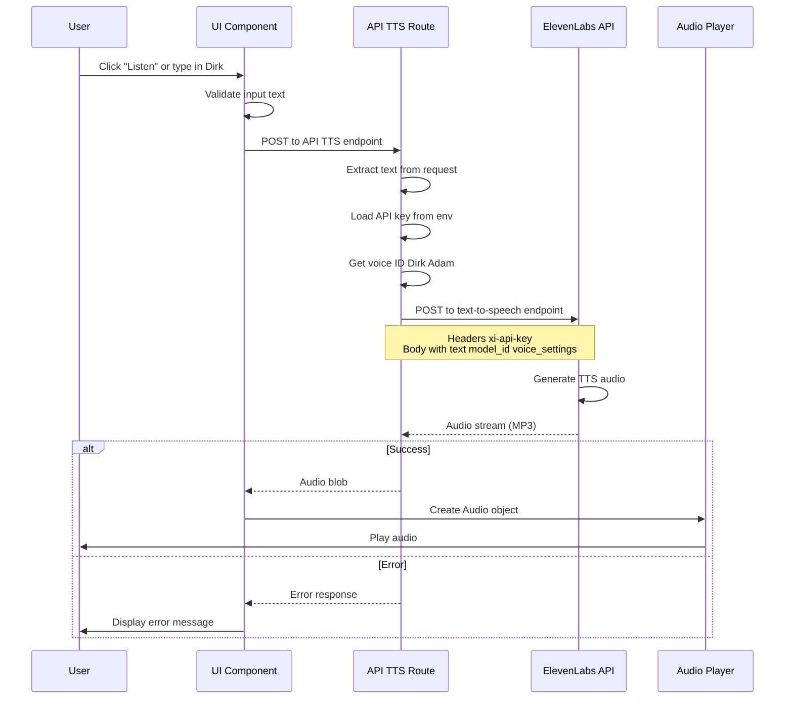
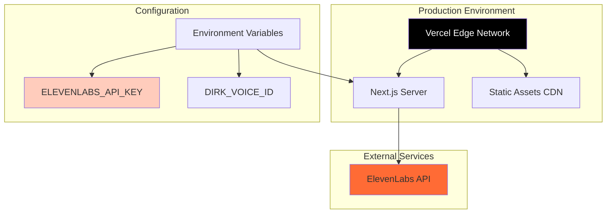

# ElevenGov Architecture

## System Overview

ElevenGov is a satirical Next.js web application that reimagines ElevenLabs voice AI technology as a 2016 European bureaucratic portal. The system integrates real ElevenLabs text-to-speech capabilities while presenting them through deliberately cumbersome bureaucratic UX.

## Architecture Diagram



## Component Architecture



## Data Flow



## Technology Stack

### Frontend
- **Framework**: Next.js 16 (React 19)
- **Language**: TypeScript
- **Styling**: Tailwind CSS + Custom CSS
- **UI Components**: shadcn/ui (Radix UI primitives)
- **State Management**: React Hooks (useState, useEffect, useRef)

### Backend
- **Runtime**: Node.js
- **API**: Next.js API Routes (App Router)
- **External Integration**: ElevenLabs REST API

### Development Tools
- **Package Manager**: pnpm
- **Type Checking**: TypeScript 5.x
- **Linting**: ESLint
- **Build**: Next.js built-in compiler

## Key Features Architecture

### 1. Terminal Assistant (Dirk)
- **Location**: `components/eleven-labs/terminal-assistant.tsx`
- **Logic**: `lib/dirk.ts`
- **Type**: Deterministic keyword-based chatbot
- **Features**:
  - Keyword matching for responses
  - Bureaucratic personality layer
  - TTS integration for message playback
  - Session logging UI

### 2. Text-to-Speech System
- **API Route**: `app/api/tts/route.ts`
- **Client Library**: `lib/pageNarrator.ts`
- **Flow**:
  1. Client sends text to `/api/tts`
  2. Server authenticates with ElevenLabs
  3. Server forwards to ElevenLabs API
  4. Server streams audio back to client
  5. Client plays audio in browser

### 3. Audio Panel
- **Location**: `components/eleven-labs/audio-panel.tsx`
- **Features**:
  - Waveform visualization (CSS animation)
  - Play/pause controls
  - TTS request management
  - Error handling

### 4. Page Narrator
- **Location**: `lib/pageNarrator.ts`
- **Purpose**: Read page content aloud
- **Implementation**: Routes through `/api/tts` API

### 5. Notice Sounds System
- **Location**: `lib/noticeSounds.ts`
- **Features**:
  - System notification sounds
  - Audio preloading
  - Multiple sound types (success, error, warning)

## Security Architecture

### API Key Management
- **Storage**: Server-side environment variables only
- **Never exposed**: Client never sees `ELEVENLABS_API_KEY`
- **Route**: All TTS requests proxy through `/api/tts`

### Environment Variables
```
ELEVENLABS_API_KEY       → Server-side only (required)
DIRK_VOICE_ID           → Server-side only (optional)
NEXT_PUBLIC_APP_URL     → Public (optional)
```

### Data Privacy
- No user data storage
- Session IDs are client-side only
- No cookies beyond consent banner
- GDPR compliance messaging (satirical)

## Deployment Architecture



### Recommended Platforms
1. **Vercel** (Primary)
   - Native Next.js support
   - Edge functions
   - Automatic HTTPS
   - Environment variable management

2. **Alternative Platforms**
   - Netlify
   - Railway
   - AWS Amplify
   - Any Node.js hosting

## Performance Considerations

### Optimization Strategies
1. **Server-side TTS Proxy**: Keeps API keys secure
2. **Audio Streaming**: Direct blob streaming from ElevenLabs
3. **Static Assets**: Preloaded notification sounds
4. **Code Splitting**: Lazy loading of components
5. **Image Optimization**: Next.js automatic image optimization

### Limitations
- **TTS Latency**: 1-3 seconds (ElevenLabs processing time)
- **Audio File Size**: ~100KB per 10 seconds of speech
- **API Rate Limits**: Based on ElevenLabs plan

## Extension Points

### Easy to Add
1. New bureaucratic sections (components)
2. Additional Dirk keyword responses
3. New notification sounds
4. Alternative voice IDs
5. Multi-language UI support

### Requires Architecture Changes
1. User authentication system
2. Database for user sessions
3. Real-time voice cloning
4. Speech-to-text integration
5. Admin dashboard

## File Structure Overview

```
ElevenGov/
├── app/                    # Next.js App Router
│   ├── api/tts/           # TTS API endpoint
│   ├── globals.css        # Global styles
│   ├── layout.tsx         # Root layout
│   └── page.tsx           # Home page
├── components/
│   ├── eleven-labs/       # Custom components (bureaucratic theme)
│   │   ├── terminal-assistant.tsx
│   │   ├── audio-panel.tsx
│   │   └── [30+ components]
│   └── ui/                # shadcn/ui components
│       └── [50+ UI primitives]
├── hooks/                 # Custom React hooks
│   └── use-mobile.ts
├── lib/                   # Business logic & utilities
│   ├── dirk.ts           # Dirk assistant logic
│   ├── pageNarrator.ts   # TTS integration
│   ├── noticeSounds.ts   # Audio notifications
│   └── utils.ts          # Utility functions
├── public/
│   └── audio/            # Static audio files
└── .env.local            # Environment variables (not in repo)
```

## Satirical Design Patterns

The architecture deliberately implements "bureaucratic anti-patterns":

1. **Over-Documentation**: Excessive metadata and headers
2. **Form References**: Every action mentions a form number
3. **Processing Times**: Artificial delays mentioned everywhere
4. **Legal Disclaimers**: Warning banners and cookie notices
5. **Rigid Styling**: No rounded corners, 1px borders, system fonts
6. **Deterministic AI**: Dirk uses keyword matching, not LLMs

This creates the comedic effect of modern AI technology trapped in 2016 government web design.
